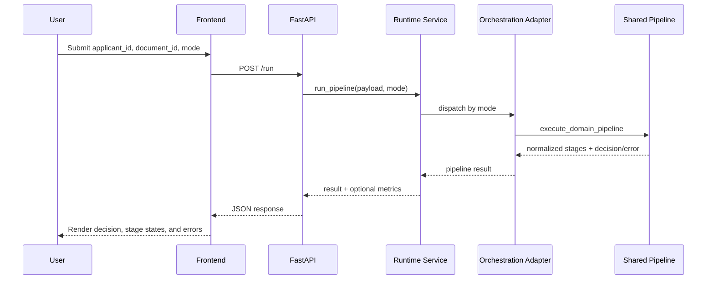

# System Architecture

## 1. Overview

This project is a productionized multi-agent loan decision system with a React frontend and a Python runtime backend. It preserves dual orchestration modes (`crewai` and `langgraph`) while enforcing a shared request/response contract and deterministic failure handling.

Primary goals:
- Framework parity across orchestration modes
- Stable API contract for UI and service clients
- Operational safety through retries, timeouts, rate limiting, structured errors, and observability
- Deployment-ready separation of frontend and backend services

## 2. High-Level Architecture

```mermaid
flowchart LR
    User[User Browser]
    FE[Frontend React App\nVite + TypeScript]
    API[FastAPI Runtime\nloan_agents.runtime.asgi]
    SVC[Runtime Service\nrun_pipeline]
    ORCH[Orchestration Adapters\ncrewai | langgraph]
    PIPE[Shared Domain Pipeline]
    DOC[Document Stage]
    CR[Credit Stage]
    RISK[Risk Stage]
    COMP[Compliance Stage]
    OBS[Observability\nlogging + metrics + redaction]

    User --> FE
    FE -->|POST /run| API
    FE -->|GET /health| API
    FE -->|GET /readiness| API

    API --> SVC
    SVC --> ORCH
    ORCH --> PIPE
    PIPE --> DOC --> CR --> RISK --> COMP

    SVC --> OBS
    PIPE --> OBS
```

## 3. Backend Architecture (Python)

### 3.1 API Layer

Module: `src/loan_agents/runtime/asgi.py`

Responsibilities:
- Exposes HTTP endpoints:
  - `GET /health`
  - `GET /readiness`
  - `POST /run`
- Applies CORS middleware from environment-driven settings
- Delegates business execution to runtime API handlers

Supporting handler module: `src/loan_agents/runtime/api.py`

Responsibilities:
- Normalizes incoming request into `PipelineInput`
- Selects execution mode (`crewai` default, or `langgraph`)
- Calls runtime service entrypoint (`run_pipeline`)
- Returns metrics when correlation ID is provided

### 3.2 Runtime Service Layer

Module: `src/loan_agents/runtime/service.py`

Responsibilities:
- Central service entrypoint: `run_pipeline(input_payload, mode)`
- Validates mode (`crewai`, `langgraph`)
- Loads runtime settings and creates execution policy
- Dispatches to orchestration adapter by mode
- Applies policy execution wrapper for retry/timeout/rate limit behavior
- Emits structured stage/failure logs
- Captures per-run metrics (stage durations, retry count, failure categories)
- Converts unexpected exceptions into standardized failure envelopes

### 3.3 Execution Policy and Safety Controls

Module: `src/loan_agents/runtime/execution_policy.py`

Implemented controls:
- In-memory rate limiting (`requests_per_minute`)
- Retry with exponential backoff
- Per-call timeout classification
- Typed policy errors for:
  - rate limit
  - timeout
  - provider execution failure

Settings source: `src/loan_agents/runtime/settings.py`

Key configuration:
- `LLM_API_KEY` (required for readiness)
- retry/backoff parameters
- request rate limit
- run timeout
- CORS origin and credentials settings

### 3.4 Orchestration Layer

Modules:
- `src/loan_agents/orchestration/crewai_adapter.py`
- `src/loan_agents/orchestration/langgraph_adapter.py`

Current behavior:
- Both adapters delegate to the same shared domain pipeline
- Mode differences are preserved at contract/dispatch level
- Output is normalized into a common pipeline result schema

Shared pipeline module: `src/loan_agents/orchestration/pipeline.py`

Stage order:
1. document
2. credit
3. risk
4. compliance

Failure model:
- If a stage fails, downstream stages are marked `skipped`
- Adapter failure is returned with structured error metadata

Normalization helper module: `src/loan_agents/orchestration/normalized.py`

Responsibilities:
- Build success envelope with consistent schema
- Build adapter failure envelope with consistent schema

### 3.5 Domain Stage Components

Modules:
- `src/loan_agents/document/__init__.py`
- `src/loan_agents/credit/__init__.py`
- `src/loan_agents/risk/__init__.py`
- `src/loan_agents/compliance/__init__.py`

Current implementation characteristics:
- Mock-driven data providers and decision rules
- Stage-level artifacts returned in response payload
- Deterministic behavior for testability and framework parity

### 3.6 Contracts and Error Shape

Contract module: `src/loan_agents/domain/contracts.py`

Core DTOs:
- `PipelineInput`
- `PipelineResult`

Error helper module: `src/loan_agents/runtime/errors.py`

Standardized failure envelope fields:
- `code`
- `message`
- `failure_category`
- `retry_count`
- `stage`

### 3.7 Observability and Data Protection

Modules:
- `src/loan_agents/runtime/logging.py`
- `src/loan_agents/runtime/metrics.py`
- `src/loan_agents/runtime/redaction.py`

Capabilities:
- Structured JSON telemetry events
- Correlation-aware run metrics
- Secret redaction in logs/metadata

## 4. Frontend Architecture (React + TypeScript)

### 4.1 UI and Interaction Layer

Root app: `frontend/src/App.tsx`

Component modules:
- `frontend/src/components/InputField.tsx`
- `frontend/src/components/ModeSelect.tsx`
- `frontend/src/components/RequestLifecycle.tsx`
- `frontend/src/components/ResultPanel.tsx`

Responsibilities:
- Collects loan request input
- Allows runtime mode selection (`crewai` or `langgraph`)
- Displays request lifecycle, health/readiness, and result/error panels

### 4.2 API Integration Layer

Module: `frontend/src/lib/api.ts`

Responsibilities:
- Calls backend endpoints (`/health`, `/readiness`, `/run`)
- Supports request timeout with abort signal
- Provides mock transport fallback for standalone mode
- Normalizes HTTP/network errors into frontend-consumable envelope

Environment module: `frontend/src/config/env.ts`

Key frontend runtime settings:
- `VITE_RUNTIME_API_URL`
- `VITE_USE_MOCK`
- `VITE_RUNTIME_TIMEOUT_MS`

## 5. End-to-End Request Flow



## 6. Deployment Architecture

Frontend deployment target:
- Vercel (config: `frontend/vercel.json`)

Backend deployment target:
- Render (config: `render.yaml`)

Containerization:
- Backend Docker image defined in `Dockerfile`

Operational endpoints:
- `GET /health` for liveness
- `GET /readiness` for dependency/config readiness
- `POST /run` for pipeline execution

## 7. Testing and Quality Gates

Backend tests:
- contract/foundation tests in `tests/foundation/`
- runtime policy/API/observability tests in `tests/runtime/`

Frontend tests:
- unit and integration tests in `frontend/tests/`

Quality toolchain:
- Python: `ruff`, `mypy`, `pytest`
- Frontend: `eslint`, TypeScript type-checking, Vitest

## 8. Architectural Characteristics

Strengths:
- Clear separation between API, runtime policy, orchestration, and domain stages
- Single normalized response contract across dual modes
- Deterministic stage pipeline with explicit skip/failure behavior
- Built-in observability and redaction support
- Deployment-ready split between UI and backend runtime

Current constraints:
- Core business stages are mock-backed (not live external integrations)
- In-memory rate limiting/metrics are process-local
- CrewAI/LangGraph adapters currently share the same internal stage implementation
